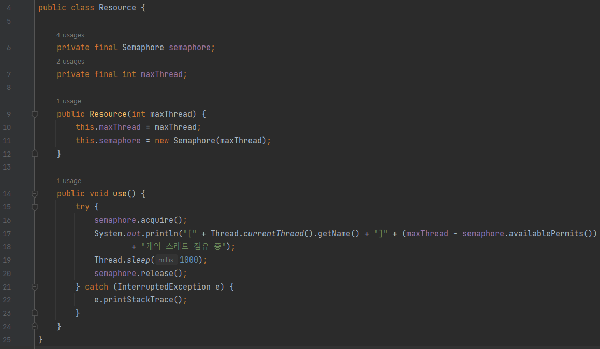
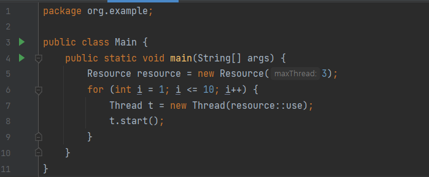
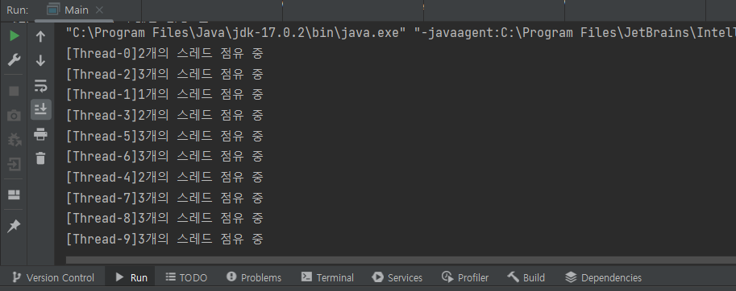

# 세마포어(Semaphore) & 뮤텍스(Mutex)

프로세스 간 메시지를 전송하거나, 공유메모리를 통해 공유된 자원에 여러 개의 프로세스가 동시에 접근하면 Critical Section 문제가 발생할 수 있다.

이를 해결하기 위해 데이터를 한 번에 하나의 프로세스만 접근할 수 있도록 제한을 두는 동기화 방식을 취해야 한다.

동기화 도구에는 대표적으로 `뮤텍스(Mutex)`와 `세마포어(Semaphore)`가 있다.

이들은 모두 공유된 자원의 데이터를 여러 쓰레드/프로세스가 접근하는 것을 막는 역할을 한다.

---

## 임계 영역(Critical Section)
> 여러 프로세스가 데이터를 공유하며 수행될 때, 각 프로세스에서 공유 데이터를 접근하는 프로그램 코드 블록


즉, 여러 프로세스가 동일 자원을 동시에 참조하여 값(공유하는 변수명, 파일 등)이 오염될 위험 가능성이 있는 영역

프로그래밍 시 성능 향상을 위해 임계영역을 최소화하는 설계를 해야 한다.

---

## 뮤텍스(Mutex)
> 동시성 프로그래밍 환경에서 **공유 불가능한 자원의 동시 사용**을 피하기 위해 사용하는 알고리즘


임계구역(Critical Section)을 가진 스레드들의 실행시간(Running Time)이 서로 겹치지 않고 각각 단독으로 실행(상호배제)되도록 하는 기술이다.

뮤텍스는 화장실이 하나 밖에 없는 식당과 비슷하다. 화장실을 가기 위해서는 카운터에서 열쇠를 받아 가야 하며 당신이 화장실을 가려고 하는데 카운터에 키가 있으면 화장실에 사람이 없다는 뜻이고 당신은 그 열쇠를 이용해 화장실에 들어갈 수 있다고 가정한다.


카운터에 열쇠가 없기 때문에 화장실에 사람이 있다는 뜻이며 화장실을 사용할 수 없습니다. 여자가 나올 때 까지 기다려야 한다.


곧이어 다른 사람도 화장실에 가려고 카운터에 대기하고 있다. 앞사람이 화장실에서 나와 카운터에 키를 돌려놓았다. 이제 기다리던 사람들 중 맨 앞에 있던 사람이 키를 받아 화장실에 갈 수 있다.

이것이 뮤텍스가 동작하는 방식이다. 화장실을 이용하는 사람은 프로세스 혹은 쓰레드이며 화장실은 공유자원, 화장실 키는 공유자원에 접근하기 위해 필요한 어떤 오브젝트이다.

즉, 뮤텍스는 Key에 해당하는 어떤 오브젝트가 있으며 이 오브젝트를 소유한 쓰레드/프로세스 만이 공유자원에 접근할 수 있다.

---

## 세마포어(Semaphore)
> 병렬성 프로그래밍 환경에서 **공유된 자원에 대한 접근**을 제한하는 알고리즘


사용하고 있는 쓰레드/프로세스의 수를 공통으로 관리하는 하나의 값을 이용해 상호배제를 달성한다. 공유 자원에 접근할 수 있는 프로세스의 최대 허용치만큼 동시에 사용자가 접근할 수 있으며, 각 프로세스는 세마포어의 값을 확인하고 변경할 수 있다.

자원을 사용하다가 자원을 사용하지 않는 상태가 될 때, 대기하던 프로세스가 즉시 자원을 사용하고. 이미 다른 프로세스에 의해 사용 중이라는 사실을 알게 되면, 일정시간 대기해야 한다.

세마포어는 손님이 화장실을 좀 더 쉽게 이용할 수 있는 레스토랑이다. 세마포어를 이용하는 레스토랑의 화장실에는 여러 개의 칸이 있고 화장실 입구에는 현재 화장실의 빈 칸 개수를 보여주는 전광판이 있다고 가정한다.


만약 당신이 화장실에 가고 싶다면 입구에서 빈 칸의 개수를 확인하고 빈 칸이 1개 이상이라면 빈칸의 개수를 하나 뺀 다음에 화장실로 입장해야 하며 나올 때 빈 칸의 개수를 하나 더해준다.


모든 칸에 사람이 들어갔을 경우 빈 칸의 개수는 0이 되며 이때 화장실에 들어가고자 하는 사람이 있다면 빈 칸의 개수가 1 혹은 양수로 바뀔 때까지 기다려야 한다.

이처럼 세마포어는 공통으로 관리하는 하나의 값을 이용해 상호배제를 달성한다. 세마포어도 아까와 똑같이 화장실이 공유자원이며 사람들이 쓰레드, 프로세스이다. 그리고 화장실 빈칸의 개수는 현재 공유자원에 접근할 수 있는 쓰레드,프로세스의 개수를 나타낸다.

---

## 뮤텍스와 세마포어의 차이점

가장 큰 차이점은 **동기화 대상의 개수** 즉, 위에서 예시로 설명한 **화장실의 개수**이다.

`뮤텍스`는 동기화 대상이 오직 1개일 때 사용하며, `세마포어`는 동기화 대상이 1개 이상일 때 사용한다.

`뮤텍스`는 자원을 소유할 수 있고, 책임을 가지는 반면 `세마포어`는 자원 소유가 불가능하다.

`뮤텍스`는 상태가 0, 1 뿐이므로 Lock을 가질 수 있고, 자원을 소유하고 있는 스레드만이 이 뮤텍스를 해제할 수 있다.
반면 `세마포어`는 세마포어를 소유하지 않는 스레드가 세마포어를 해제할 수 있다.

`세마포어`는 시스템 범위에 걸쳐 있고, 파일 시스템 상의 파일로 존재합니다. 반면, `뮤텍스`는 프로세스의 범위를 가지며 프로세스 종료될 때 자동으로 Clean up 된다.

---

## 뮤텍스 예시
```
mutex = 1;

void lock () {
	while (mutex != 1) {
    	/* mutex 값이 1이 될 때까지 기다린다.*/
    }
    /* 이 구역에 도착했다는 것은 mutex 값이 1이라는 것이다.
       따라서 이제 뮤텍스 값을 0으로 만들어 다른 프로세스(혹은 쓰레드)가 접근하지 못하도록 막아야한다.
    */
    mutex = 0;
}

void unlock() {
	/* 임계 구역에서 나온 프로세스는 다른 프로세스가 접근할 수 있도록 락을 해제한다.*/
	mutex = 1;
}
```

## 세마포어 예시







---

뮤텍스와 세마포어는 모두 완벽한 기법은 아니므로 데이터 무결성을 보장할 수는 없으며 모든 교착상태를 해결하지는 못한다. 하지만 상호배제를 위한 기본적인 문법이며 여기에 좀 더 복잡한 매커니즘을 적용해 개선된 성능을 가질 수 있도록 하는 것이 중요하다.